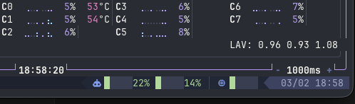

# Claude Code Max Usage

[](LICENSE)
[](scripts/claude_usage.sh)
[](https://github.com/tmux-plugins/tpm)
[](https://starship.rs)

Display [Claude Code](https://docs.anthropic.com/en/docs/claude-code) (Max Plan) API usage in your **tmux status bar** or **Starship prompt**.

Shows 5-hour and 7-day utilization as compact progress bars with color-coded thresholds.



## Features

- 5-hour and 7-day utilization with color-coded progress bars
- Configurable thresholds: green (OK) / yellow (warning) / red (critical)
- Stale-while-revalidate caching (default 5 min) for zero-latency status updates
- Works as a **tmux TPM plugin**, **Starship custom module**, or **standalone script**
- Shared cache between tmux and Starship prevents duplicate API calls
- Pure bash + jq + curl — no extra dependencies

## Requirements

- `bash` (4.0+)
- `jq`
- `curl`
- Claude Code Max Plan with OAuth credentials at `~/.claude/.credentials.json`

## Installation

### tmux (via TPM)

1. Add to your `~/.tmux.conf`:

```tmux
set -g @plugin 'matsubo/claude-code-max-usage'
```

2. Add the interpolation string to your status bar:

```tmux
# Full format: 󰚩 ██░░░22% █░░░░14%
set -g status-right "#{claude_usage}"

# Compact format: 22%/14%
set -g status-right "#{claude_usage_compact}"
```

3. Install with `prefix` + <kbd>I</kbd> (capital I).

### Starship

Add to your `~/.config/starship.toml`:

```toml
[custom.claude]
command = "/path/to/claude-code-max-usage/scripts/claude_usage_starship.sh"
when = "test -f ~/.claude/.credentials.json"
format = "[$output]($style) "
style = ""
shell = ["bash", "--noprofile", "--norc"]
```

### Standalone

Run directly in any terminal:

```bash
# Full format with ANSI colors
./scripts/claude_usage.sh --mode=ansi

# Compact format
./scripts/claude_usage.sh --mode=ansi --compact
```

## Configuration

All options can be set via tmux options (`@claude_usage_*`) or environment variables.
tmux options take precedence when running inside tmux.

| tmux option | env var | default | description |
|---|---|---|---|
| `@claude_usage_cache_ttl` | `CLAUDE_USAGE_CACHE_TTL` | `300` | Cache TTL in seconds |
| `@claude_usage_bar_width` | `CLAUDE_USAGE_BAR_WIDTH` | `5` | Progress bar width (chars) |
| `@claude_usage_green` | `CLAUDE_USAGE_GREEN` | `#a6da95` | OK color |
| `@claude_usage_yellow` | `CLAUDE_USAGE_YELLOW` | `#eed49f` | Warning color |
| `@claude_usage_red` | `CLAUDE_USAGE_RED` | `#ed8796` | Critical color |
| `@claude_usage_dim` | `CLAUDE_USAGE_DIM` | `#7a839e` | Dim/empty bar color |
| `@claude_usage_label` | `CLAUDE_USAGE_LABEL` | `#769ff0` | Icon color |
| `@claude_usage_threshold_warn` | `CLAUDE_USAGE_THRESHOLD_WARN` | `50` | Warning threshold (%) |
| `@claude_usage_threshold_crit` | `CLAUDE_USAGE_THRESHOLD_CRIT` | `80` | Critical threshold (%) |
| `@claude_usage_credentials` | `CLAUDE_USAGE_CREDENTIALS` | `~/.claude/.credentials.json` | Credentials path |
| `@claude_usage_icon` | `CLAUDE_USAGE_ICON` | `󰚩` | Display icon |

Example tmux configuration:

```tmux
set -g @claude_usage_cache_ttl 600
set -g @claude_usage_threshold_warn 40
set -g @claude_usage_threshold_crit 70
```

Example environment variables (for Starship / standalone):

```bash
export CLAUDE_USAGE_CACHE_TTL=600
export CLAUDE_USAGE_THRESHOLD_WARN=40
```

## Output Format

**Full** (default): `󰚩 ██░░░22% █░░░░14%`
- Icon + 5-hour bar + 7-day bar
- Each bar: filled blocks + empty blocks + percentage

**Compact** (`--compact`): `22%/14%`
- 5-hour percentage / 7-day percentage

Colors change based on thresholds:
- **Green**: below warning threshold (default <50%)
- **Yellow**: between warning and critical (default 50-79%)
- **Red**: above critical threshold (default >=80%)

## How It Works

1. Reads OAuth token from `~/.claude/.credentials.json`
2. Calls the Anthropic usage API (`/api/oauth/usage`)
3. Extracts `five_hour.utilization` and `seven_day.utilization`
4. Renders colored progress bars (tmux format or ANSI escapes)
5. Caches the result for `CACHE_TTL` seconds with stale-while-revalidate

The cache is shared at `/tmp/tmux-claude-cache`, so both tmux and Starship use the same data without duplicate API calls.

## License

[MIT](LICENSE)
